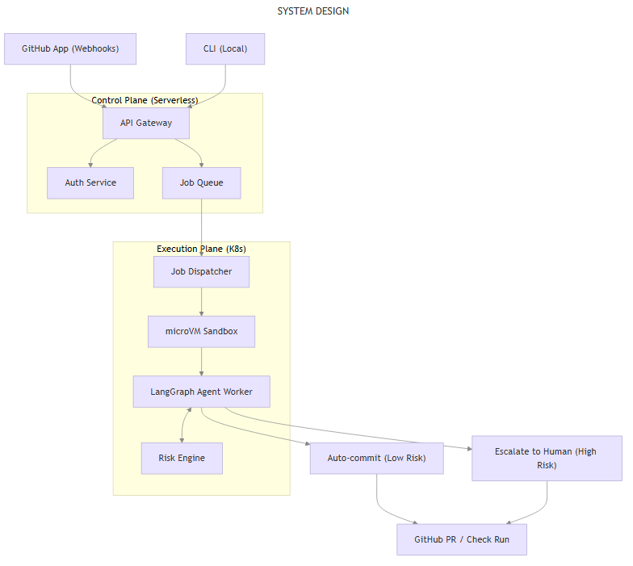
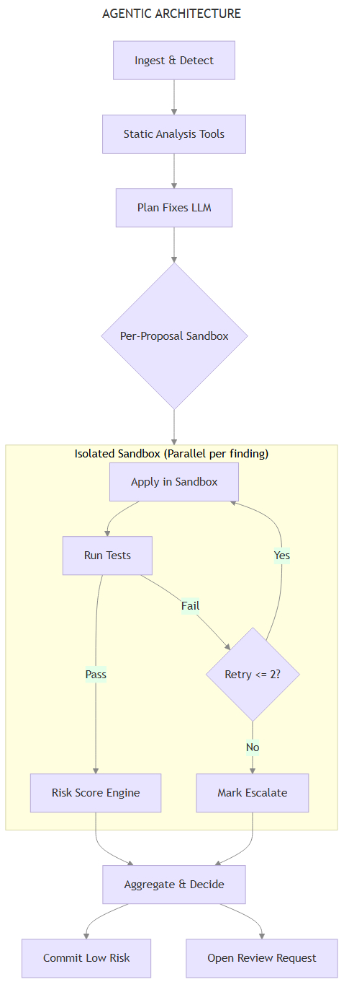
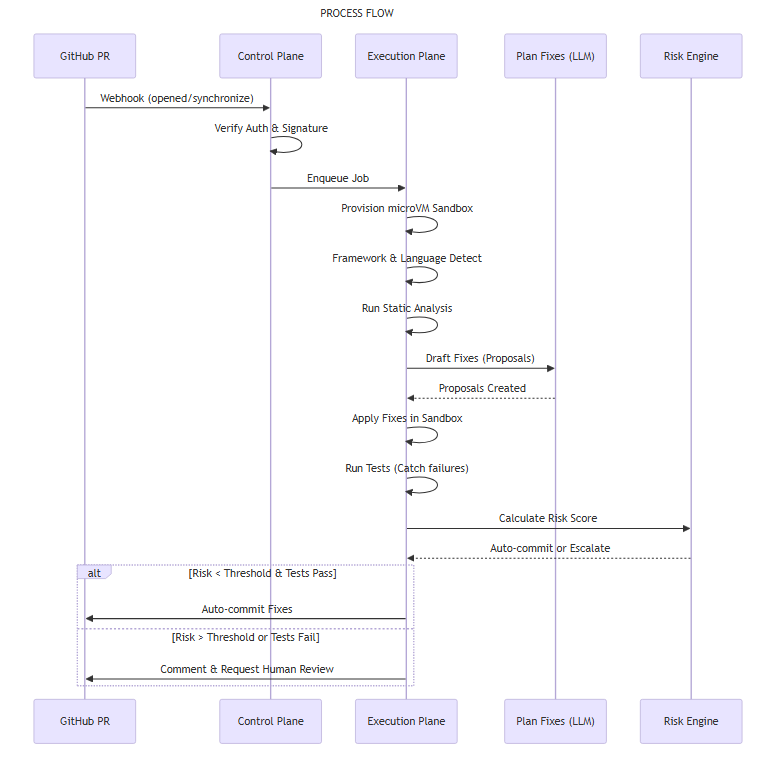

# Autonomous Code Review Agent

**LangGraph, Agentic AI, Kubernetes, FastAPI, gVisor, LLMs**

An AI-powered, fully autonomous code reviewer that understands your framework, runs your tests, and writes safe fixes. Using a deterministic risk model, it autonomously commits low-risk fixes directly to the PR branch and escalates high-risk changes to human developers.

## Highlights
- **System Design:** Control Plane for serverless GitHub webhook intake and Execution Plane pulling jobs into ephemeral Kubernetes microVMs (gVisor/Firecracker).
- **Agentic Architecture:** Moved beyond a single-trajectory ReAct loop to a resilient, resumable plan-and-execute LangGraph topology with a per-proposal sandbox subgraph.
- **Process Flow:** The agent applies patches and runs the project's actual test suite; it receives a bounded retry budget for self-correction before routing through a hard-gate risk engine.

---

## 1. System Design

Split into a **Control Plane** for webhook intake and an **Execution Plane** for
running untrusted PR code.



- **Control Plane:** FastAPI. Verifies HMAC signatures, deduplicates deliveries,
  rate limits, mints scoped GitHub App installation tokens, and starts the review.
- **Execution Plane:** applies patches and runs the project's test command off the
  main tree, with all secrets stripped from the child environment.
- **Risk Engine:** deterministic weighted scoring with hard gates on test failure
  and file criticality. No LLM sits in the commit decision.

> **Implementation status.** The system now fully isolates the Control and Execution planes.
> The webhook processing relies on an **ARQ Redis Queue**, which delegates heavy LangGraph jobs
> to background worker pods. Execution happens inside **gVisor (`runsc`)** isolated containers.
> The architecture is scaled automatically from 0-10 pods via **KEDA** on Kubernetes.
> The design doc (`autonomous-code-review-agent-architecture.md`) describes the full target.

## 2. Agentic Architecture (LangGraph Topology)

A resumable **plan-and-execute** graph, not a single-trajectory ReAct loop.



```
ingest_and_detect → static_analysis → plan → draft_fixes
    → Send(one branch per proposal) → verify_proposal ⟲ repair
    → collect → [replan ⟲ draft_fixes]
    → risk_score → aggregate_and_decide
```

1. **Ingest & Detect** — parses lockfiles (`pyproject.toml`, `uv.lock`,
   `package-lock.json`, …) to infer language, framework and test command.
2. **Static Analysis** — ruff, bandit and mypy fan out in parallel over the
   changed files, plus an LLM semantic pass under a hard token budget.
3. **Plan** — the planner decides which findings are worth fixing and how, and
   skips the ones that need a product decision.
4. **Draft Fixes** — one unified diff per planned finding.
5. **Per-Proposal Sandbox Subgraph** — each proposal gets its own tree, its own
   test run, and a bounded repair budget: on failure the error is fed back to the
   model, the diff is redrafted, and the cycle repeats until it passes or the
   budget is spent.
6. **Collect / Replan** — proposals that exhaust their repair budget get one
   round of genuinely different approaches before being handed over.
7. **Risk Score & Decide** — each proposal is scored against *its own*
   verification result, then the auto-commit batch is re-verified together
   before it is pushed.

Graph state is checkpointed to Postgres per node, so a crashed review can be
inspected and resumed rather than restarted.

## 3. Process Flow



1. Developer opens or updates a PR; GitHub fires a webhook.
2. Signature verified, delivery deduplicated, PR head cloned with a scoped token.
3. Findings are planned, patched, and each patch is verified in a sandbox.
4. **The hard gate:** tests fail, blast radius too large, or the patch would not
   apply → escalate with the diff in a PR comment. Tests green and risk below
   threshold → commit and push to the PR branch.

## 4. Running it

### Prerequisites
- Python 3.11+, Docker, and a GitHub App (or a `GITHUB_TOKEN` for read-only runs).
- `cp .env.example .env` and fill in `OPENAI_API_KEY`.

### Local CLI (no GitHub needed)

```bash
docker compose up -d postgres redis
pip install -e ".[dev]"
alembic upgrade head

# Review the working-tree diff of any repo. Never writes to your checkout.
python -m src.cli --repo /path/to/repo --log-format plain

# Resume a run that crashed or was interrupted
python -m src.cli --resume <job-id>
```

### Live PR review

```bash
docker compose up --build            # postgres + redis + api on :8001
```

1. Create a GitHub App with **Pull requests: read & write**, **Contents: read &
   write**, and the **Pull request** webhook event.
2. Set `GITHUB_APP_ID`, `GITHUB_PRIVATE_KEY`, `GITHUB_WEBHOOK_SECRET` in `.env`.
3. Expose the API and point the App's webhook URL at `/webhook`:
   ```bash
   ngrok http 8001         # or: cloudflared tunnel --url http://localhost:8001
   ```
4. Install the App on a test repository and open a PR.

Without `GITHUB_WEBHOOK_SECRET`, signature verification is **not installed** and
the endpoint accepts unsigned payloads — the app logs a warning at startup. Set
it before exposing anything publicly.

### Watching a review

Every log line is JSON with the `job_id`, and each graph node emits
`node.start` / `node.done` with a duration:

```bash
docker compose logs -f api | grep '"node"'
```

Two endpoints read the persisted checkpoint directly:

```bash
curl localhost:8001/jobs/<job-id>          # status, next node, findings, retries
curl -X POST localhost:8001/jobs/<job-id>/resume
```

Set `LANGSMITH_TRACING=true` and `LANGSMITH_API_KEY` for per-call LLM traces.

## 5. Tests

```bash
pytest
```

Covers diff validation and patch application, the sandbox environment allowlist,
the repair budget in the per-proposal subgraph, fan-out/fan-in and replan
routing, risk scoring, and every branch of the auto-commit vs escalate decision.

## 6. Roadmap

| Stage | Scope | Status |
|---|---|---|
| 0 | Secret isolation in the sandbox, packaging, hygiene | Done |
| 1 | Verified auto-commit and push to the PR branch | Done |
| 2 | Plan-and-execute topology, per-proposal subgraph, repair budget, observability | Done |
| 3 | Redis Streams queue + separate worker, retries, run/audit persistence, autonomy modes | Done |
| 4 | Real sandbox isolation via gVisor (`runsc`), no host network, resource caps | Done |
| 5 | Kubernetes deployment, KEDA scaling on queue depth, `RuntimeClass: gvisor` | Done |
| 6 | CI, dogfooding the agent on this repository | Done |
